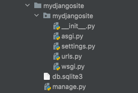
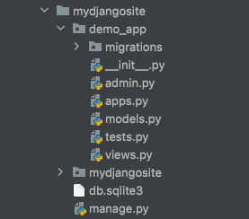
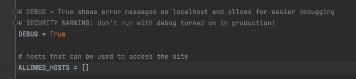
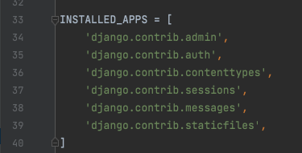
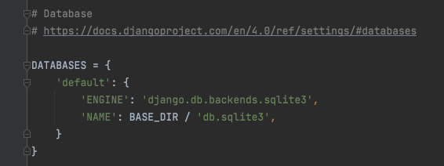

## initial setup
### create a virtual environment
```bash
python3 -m venv django_venv
source django_venv/bin/activate
```

### install django
```bash
python3 -m pip install django
python3 -m django --version
```
https://docs.djangoproject.com/en/4.0/topics/install/


### start a django project
```bash
django-admin startproject mydjangosite
```

### verify that your django project works
```bash
cd mydjangosite
python manage.py runserver
```

### django project structure

* `settings.py` is the configuration file of the project
* `urls.py` holds the web content of the project
* `manage.py` is used to execute commands for the project

## create a new app
```bash
python manage.py startapp demo_app

# OR  
django-admin startapp main_app
django-admin startapp secondary_app
```

### django app structure

* the app is created by default in the same directory as the `manage.py` file
  * `admin.py` is the admin page of the app
  * `models.py` stores the backend logic for the app
  * `views.py` stores the business logic for the app
    * function-based views
    * class-based views
  * `migrations.py` is used to reflect changes to the model files

### what is the difference between a django app and a django project?
* **project**
  * a collection of configuration and apps for a given website
  * a project can contain multiple apps

* **app**
  * a web application that does something
  * essentially, an app is like a separate module


## ADJUST configuration of the project

* **Add the domain name** through which your app should be accessible to ALLOWED_HOSTS


```python
# hosts that can be used to access the site
ALLOWED_HOSTS = [
    '127.0.0.1',            # localhost
    'demo-django-app.com'   # prod
]
```

* **To include an app in a project**, add a reference to its config class in `settings.py`


```python
INSTALLED_APPS = [
    'django.contrib.admin',
    'django.contrib.auth',
    'django.contrib.contenttypes',
    'django.contrib.sessions',
    'django.contrib.messages',
    'django.contrib.staticfiles',
    'demo_app.apps.DemoAppConfig'
]
```

* **Point to your backend database**

```python

```

### update views.py
```python
from django.shortcuts import render, redirect
from django.http import HttpResponse

# Create your views here.
def home_page(request):
	return render(request, 'index.html')
	# subdirectory within templates expected
```


### create urls.py in the app directory
```python
from django.urls import path, include
from . import views

urlpatterns = [
    path('', views.home_page, name= 'demo-home'),
]
```

### update urls.py in the project directory to point to the app urls
```python
from django.contrib import admin
from django.urls import path, include


urlpatterns = [
    path('admin/', admin.site.urls),
    path('', include('demo.urls')),
]
```