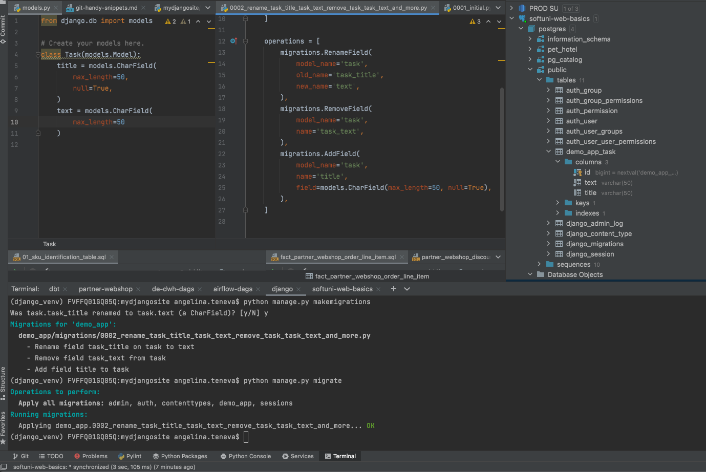

## initial setup
* ### create a virtual environment
```bash
python3 -m venv django_venv
source django_venv/bin/activate
```

* ### install django
```bash
python3 -m pip install django
python3 -m django --version
```
https://docs.djangoproject.com/en/4.0/topics/install/


* ### start a django project
```bash
django-admin startproject mydjangosite
```

* ### verify that your django project works
```bash
cd mydjangosite
python manage.py runserver
```

* ### django project structure

* `settings.py` is the configuration file of the project
* `urls.py` holds the web content of the project
* `manage.py` is used to execute commands for the project

## create a new app
```bash
python manage.py startapp demo_app

# OR  
django-admin startapp main_app
django-admin startapp secondary_app
```

* ### django app structure

* the app is created by default in the same directory as the `manage.py` file
  * `admin.py` is the admin page of the app
  
  * `models.py` stores the backend data logic for the app
    * each model is a Python class
    * use `models.py` to create a database table for the app
      * each model maps to a single database table
      * each attribute of the model represents a database field
      * the databse by default is created in `public.<appname_classname>`
  

  

NB! django can also be integrated with existing db by `python manage.py inspectdb > models.py`


  * `views.py` stores the main logic that needs to happen when a URL is reached
    * each view takes a web-request and returns a web response
    * views can be: 
      * function-based views
      * class-based views
    * the names of the views are usually related to the URL being reached
    

  * `migrations.py` is used to reflect changes to the model files
    * all migration files are stored in `<app_name>.migrations`
    * a log of all applied migrations is stored in `public.django_migrations` table

### what is the difference between a django app and a django project?
* **project**
  * a collection of configuration and apps for a given website
  * a project can contain multiple apps

* **app**
  * a web application that does something
  * essentially, an app is like a separate module

---------

### ADJUST configuration of the project

* ### **Add the domain name** through which your app should be accessible to **ALLOWED_HOSTS**


```python
# hosts that can be used to access the site
ALLOWED_HOSTS = [
    '127.0.0.1',            # localhost
    'demo-django-app.com'   # prod
]
```

* ### **Point to your backend database**


```python
DATABASES = {
    'default': {
        'ENGINE': 'django.db.backends.postgresql',
        'OPTIONS': {
            'service': 'my_service',
            'passfile': '.my_pgpass',
        },
    }
}

#my_service
[my_service]
host=localhost
user=USER
dbname=NAME
port=5432

#.my_pgpass
localhost:5432:NAME:USER:PASSWORD
```

```python
# settings.py
DATABASES = {
    'default': {
        'ENGINE': 'django.db.backends.mysql',
        'OPTIONS': {
            'read_default_file': '/path/to/my.cnf',
        },
    }
}

# my.cnf
[client]
database = NAME
user = USER
password = PASSWORD
default-character-set = utf8
```

https://docs.djangoproject.com/en/4.0/ref/databases/

* ### **To include an app in a project**, add a reference to its config class in `settings.py`


```python
INSTALLED_APPS = [
    'django.contrib.admin',
    'django.contrib.auth',
    'django.contrib.contenttypes',
    'django.contrib.sessions',
    'django.contrib.messages',
    'django.contrib.staticfiles',
    'demo_app.apps.DemoAppConfig'
]
```

* update ITS `views.py`
```python
from django.shortcuts import render, redirect
from django.http import HttpResponse

# Create your views here.
def home_page(request):
	return render(request, 'index.html')
	# subdirectory within templates expected
```


* create `urls.py` in the app directory
```python
from django.urls import path, include
from . import views

urlpatterns = [
    path('', views.home_page, name= 'demo-home'),
]
```

* update `urls.py` in the project directory to point to the app urls
```python
from django.contrib import admin
from django.urls import path, include


urlpatterns = [
    path('admin/', admin.site.urls),
    path('', include('demo.urls')),
]
```
